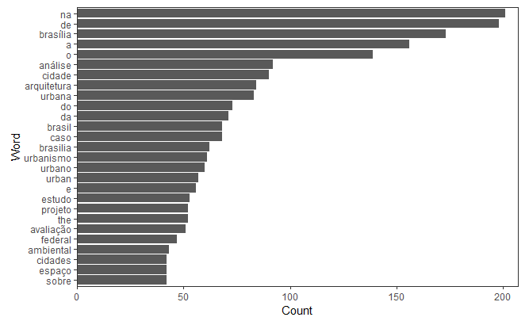
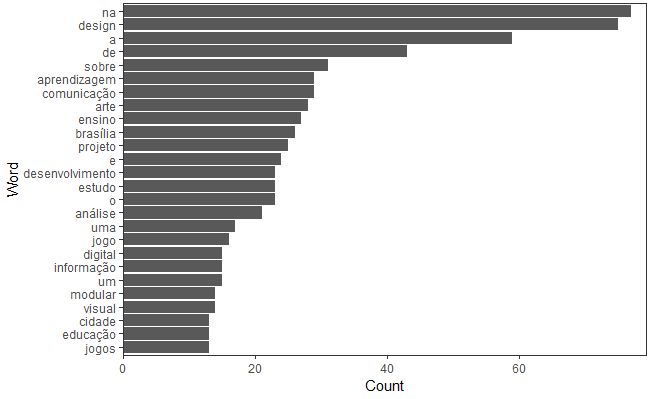
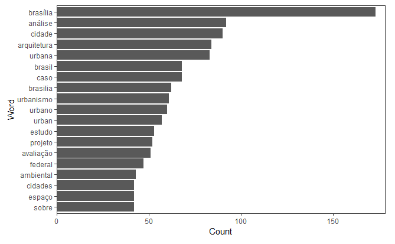
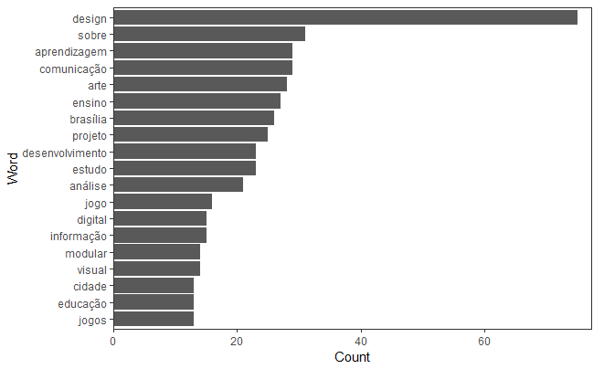
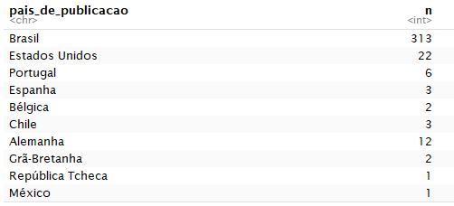

```{r setup, include=FALSE}
knitr::opts_chunk$set(echo = TRUE)
```

# 1. Introdução

Este relatório se propõe a explorar, interpretar e analisar cursos de Pós Graduação da Universidade de Brasília (UnB). Mais especificamente na área de conhecimento de Arquitetura e Urbanismo e Design. Como fonte de pesquisa será utilizada a plataforma e-Lattes UnB, que disponibiliza arquivos _json_ de todos os cursos da UnB. Nestes arquivos podemos explorar dados que contém informações sobre *publicações*, *perfil dos autores das publicações*, *período de atuação dos autores*, *categorias das publicações em cada ano*, dentre outros.

Além da análise dos dados, será apresentado um referencial teórico sobre as áreas de conhecimento presentes neste relatório, além da aplicação da metodologia *CRISP-DM* que é utilizada na Ciência de Dados.

### 1.1 Ciência de Dados

Data Science ou Ciência de Dados permite a extração de informações extremamente valiosas a partir de dados contidos em qualquer corporação ou empresa. Na era do Big Data, a ciência de dados está se tornando um campo promissor para processar grandes volumes gerados por diversas fontes e em diferentes velocidades. [5]

Em resumo é uma ciência que visa estudar as informações, seu processo de captura, transformação, geração e, posteriormente, análise de dados. [5]

A ciência de dados difere das análises estatísticas e da ciência da computação em seu método que é aplicado a dados coletados usando princípios científicos. A ciência de dados está procurando descobrir conhecimento a partir de uma quantidade grande e pesada de dados que podem ser usadas para tomar decisões e fazer previsões, e não simplesmente a interpretação de números. [5]

Para organizar, categorizar, estruturar e, depois, analisar essa quantidade exorbitante de dados, o data scientist é o profissional mais indicado. Este especialista também deve ser capaz de realizar tarefas, como extrair dados de bancos de dados MySQL e transformá-los em informações úteis e decifráveis por executivos de negócios por meio de gráficos e dashboards. [5]

No livro R for Data Science, os autores definem o fluxograma do processo de Data Science com seis etapas que englobam desde a coleta dos dados até a comunicação dos resultados com os públicos interessados, de maneira automatizada e rápida. As etapas são: importação, organização, transformação, visualização, modelagem e comunicação. Portanto, data science é a maneira de gerar conhecimento, de fazer ciência a partir dos dados. [5]


## 1.2 Cursos de Pós Graduação

Segundo a Capes, Programa de Pós-Graduação é o conjunto formado pelos cursos de mestrado e/ou doutorado acadêmicos ou de mestrado profissional de uma Instituição de Ensino Superior - IES atuante numa mesma área do conhecimento - sua área básica - que compartilha essencialmente o mesmo corpo docente e tem uma estrutura administrativa comum. Programas são divididos em acadêmicos ou profissionais, de acordo com a natureza do(s) curso(s).

A aplicação Coleta de Dados é um sistema informatizado da Capes, desenvolvido com o objetivo de coletar informações dos programas de pós-graduação stricto sensu do país. Com o lançamento da Plataforma Sucupira, o Coleta de Dados foi reformulado e passa a ser um dos módulos que a constituem.

A Plataforma Sucupira é uma importante ferramenta para coletar informações, realizar análises e avaliações e ser a base de referência do Sistema Nacional de Pós-Graduação - SNPG. A Plataforma deve disponibilizar em tempo real e com muito mais transparência as informações, processos e procedimentos que a Capes realiza no SNPG para toda a comunidade acadêmica. [3]


# 2. CRISP-DM

O desenvolvimento e apresentação de resultados, como sugerido no plano de ensino, deve seguir a metodologia CRISP-DM (__Cross Industry Standard Process for Data Mining__), que é um dos melhores e mais conhecidos modelos de análise e exploração de dados. Proposto em 1996, o modelo trata-se de um processo de data mining ou mineração de dados desvendo fases e o correto caminho a ser seguido quando estamos lidando com análise de dados e seus problemas relacionados. [6]

O processo é composto por 6 (seis) grandes etapas principais: Business Understanding; Data Understanding; Data Preparation; Modeling; Evaluation; Deployment. É importante destacar que o processo e ela é interativa e incremental e não necessariamente linear de uma fase para a outra, o que pode ser visto na figura a seguir. [6]

No relatório, o CRISP-DM será utilizado como metodologia de exploração de dados, a fim de obter uma


## 2.1 Compreensão de Negócios

A primeira e uma das etapas mais importantes do processo consiste em realizar e extrair informações relevantes sobre qual o contexto a ser trabalhado, qual a área de conhecimento, quais os objetivos e requisitos do projeto para poder, assim, traçar um plano claro sobre as ações que devem ser tomadas. [6]

No contexto da disciplina de Data Science 4 All (DS4A) & Ciência de Dados Aplicada, nos cursos de Arquitetura e Urbanismo e Design, o objetivo traçado foi extrair informações relevantes referentes as publicações e os autores destes cursos, tais como publicações por ano, publicações por país, palavras relevantes nas publicações, autores com mais publicações, dentre outros.

### 2.1.1 O Contexto

Atualmente, a sociedade vive um processo de transição para algo que nós chamamos de Quarta Revolução Industrial [7]. "Estamos a bordo de uma revolução tecnológica que transformará fundamentalmente a forma como vivemos, trabalhamos e nos relacionamos. Em sua escala, alcance e complexidade, a transformação será diferente de qualquer coisa que o ser humano tenha experimentado antes" como cita o alemão Klaus Schwab em seu livro "A Quarta Revolução Industrial", e esta, por sua vez, é caracterizada pela era em que vivemos hoje em dia: a sociedade do conhecimento.

Uma característica importantíssima que caracteriza nossa sociedade hoje em dia é a aquisição de conhecimento e a valorização do mesmo no mercado profissional, onde o foco principal é a transformação de informação em conhecimento [8]. Com isso em mente, tem-se que a evolução da sociedade tem como objetivo aumentar o número de pessoas qualificadas nos seus diversos contextos científicos e acadêmicos.

O Programa Nacional de Pós-Graduação integrado por programas de pós-graduação avaliados e reconhecidos pela Coordenação de Aperfeiçoamento de Pessoal de Nível Superior (CAPES) é um dos principais responsáveis pela produção de conhecimento científico no país [9].

O gráfico abaixo mostra a evolução na quantidade de programas de Pós-graduação desde de 1998 à 2017, dados fornecidos pelo GEOCAPES.

```{r echo=TRUE}
library(dplyr)
library(magrittr)
library(ggplot2)

dados.geocapes <- read.csv("dados/dados-pos-graduacao-geocapes.CSV", sep=";")
summarized <- dados.geocapes %>% group_by(Ano, UF) %>% summarise(Total=n())
color.list <- c("#FF5A5F", "#FFB400", "#007A87", "#FFAA91", "#7B0051", "#3b5998", "#6d84b4", "#afbdd4", "#d8dfea", "#5380E4", "#E12A3C", "#FFBF03", "#00B723", "#F14000", "#67B6C3", "#F0DA47", "#EBEBE6", "#D0D0CB", "#55ACEE", "#292f33", "#8899a6", "#e1e8ed", "#3595D6","#92C746","#F2C100","#FF6D19", "#6F3598")
ggplot(title="Teste",data=summarized, aes(x=Ano, y=Total)) + geom_bar( mapping = aes(x=Ano, fill=UF),  stat = "identity") + scale_fill_manual(values = color.list )

```


De acordo com o gráfico, com o passar dos anos, o interesse e criação de cursos de pós-graduação obtiveram um aumento significativo dentro dos útimos 19 anos, onde, em São Paulo, por exemplo, o número de programas em 1998 era de 450 e hoje ultrapassa o dobro desse valor, com 915 programas. A quantidade total de programas aumentou de 1.259 para 4.296 no mesmo período. A mesma tendência de evolução seguiu tanto para o número de discentes que aumentou de 44274 para 90188 também no estado de São Paulo.

Dos principais objetivos do PNPG de 2011 à 2020 estão:

* Estímulo à criação de Programas com ciclo completo (Mestrado e Doutorad);
* Inserção do Mestrado profissional;
* Internacionalização
    * envio de estudantes e docentes ao exterior;
    * aumento da quantidade e qualidade de publicações;
    * estímulo à participação em eventos no exterior;
    * atrair discentes e docentes à estudarem no exterior.

### 2.1.2 Arquitetura e Urbanismo

Simultaneamente à criação da Universidade de Brasília em 1962, o Curso de Mestrado em Arquitetura foi iniciado como o primeiro do país nesta área.  Em 1965 o curso foi sumariamente encerrado devido à crise política do período, retornando apenas em 1976 no  quadro do 2o Plano Nacional de Desenvolvimento com a criação do Mestrado em Planejamento Urbano.

O objetivo principal era atender as demandas por capacitação de recursos humanos no campo das políticas públicas e do desenvolvimento das cidades, contando com apoio do então Conselho Nacional de Política Urbana da Secretaria de Planejamento. [1]

Em 1986, foi criado o Mestrado em Desenho Urbano para o estudo da configuração físico-espacial das cidades. Este programa se consolidou como um dos principais centros de irradiação de conhecimentos nas áreas de Planejamento e Desenho Urbano.

Com mais de 40 anos de existência, O Programa de Pesquisa e Pós-Graduação da Faculdade de Arquitetura e Urbanismo da Universidade de Brasília (PPG-FAU/UnB) enfrentou desafios e transformações. Na última década o perfil do corpo de docentes e pesquisadores perceberam a necessidade de uma nova estrutura para abranger as mudanças no Curso de Mestrado e a criação do Curso de Doutorado em Arquitetura e Urbanismo. Em 2002 a proposta foi aprovada pela CAPES.


As áreas de concentração de pesquisa em que o Programa se fundamenta são: 

#### *Teoria, história e crítica*

A área de concentração Teoria, História e Crítica realiza pesquisas em torno dos processos históricos de concepção, transformação e reflexão sobre arte, arquitetura e cidade. A formação nessa área transita desde os fundamentos epistemológicos e sociais da cultura material até a articulação crítica do pensamento sobre o patrimônio cultural, passando pelo estudo empírico e documental, com metodologias diversas e enfoque interdisciplinar. Acolhe recortes espaço-temporais diversos, com ênfase na região de Brasília em perspectiva diacrônica. [2]

Dentro desta área estão as seguintes linhas de pesquisa:

- História e Teoria da Arquitetura;
- História e Teoria da Cidade e do Urbanismo;
- Patrimônio e Preservação;
- Estética, Hermenêutica e Semiótica.


#### *Tecnologia, ambiente e sustentabilidade*

A área de Tecnologia, Ambiente e Sustentabilidade compreende estudos relativos a técnicas e processos ligados à produção da Arquitetura e do ambiente construído, com especial atenção à questão da sustentabilidade. Os sistemas estruturais são estudados no âmbito específico da Arquitetura e etapas da construção, desde os projetos e técnicas de produção até seu desempenho são objeto de pesquisas. O contexto urbano comparece com pesquisas relativas a qualidade do espaço e sua gestão, reabilitação em seus aspectos físicos e socioambientais. [2]

Dentro desta área estão as seguintes linhas de pesquisa:

- Estruturas e Arquitetura;
- Sustentabilidade, Qualidade e Eficiência do ambiente construído;
- Tecnologia de produção do ambiente construído.


#### *Projeto e Planejamento*

A área de Projeto e Planejamento abarca estudos sobre políticas, planos e gestão em escalas diversas, do edifício ao território. As pesquisas voltadas para o âmbito edilício envolvem estratégias projetuais, configuração, representação e acessibilidade. Entre os temas diversos dos estudos relacionados ao urbano, podem-se citar análises e proposições sobre planejamento urbano e territorial, legislação, reabilitação, regularização fundiária urbana e mobilidade. [2]

Dentro desta área estão as seguintes linhas de pesquisa:

- Projeto e Planejamento Edilício;
- Projeto e Planejamento Urbano e Regional.


O programa conta com uma nota 4 de acordo com a última avaliação Quadrienal dentro do valor estabelecido das notas dos cursos da CAPES, que podem variar de 1 à 7. Segue o quadro com a avaliação do programa, tanto de mestado quanto para doutorado, desde sua criação.

Nível | 1996 | 1998 | 2001 | 2004 | 2007 | 2008 | 2009 | 2010 | 2011 | 2012 | 2013 | 2014 | 2017
----- | ---- | ---- | ---- | ---- | ---- | ---- | ---- | ---- | ---- | ---- | ---- | ---- | ---- 
Mestrado | - | -	| 4|	4|	3|	3|	3|	4|	4|	4|	4|	4|	4
Doutorado | C	|3	|4	|4	|3	|3	|3	|4	|4	|4	|4	|4|	4


O curso atualmente conta 187 alunos de pós-graduação, sendo 114 de Mestrado e 73 de Doutorado. Dentro da função idealizada para a UnB, o programa tem como principal objetivo a formação de recursos humanos de alto nível para o desenvolvimento de atividades de docência e pesquisa, bem como a estruturação de um corpo técnico de especialistas para atuação em órrgãos públicos. Em  relação à avaliação anterior, 8 alunos permanecem como estudantes, 17 alunos trabalham fora da esfera pública ou da docência, 57 alunos trabalham no setor de educação e 39 alunos são servidores públicos. À partir disso, pode-se observar que de maneira geral os objetivos têm sido alcançados, com a maior espera de participantes do programa atuam na educação ou serviço público.

O número total de Docentes é de 42, sendo 30 permanentes, 12 colaboradores e 0 visitantes. De acordo com o quadro de Corpo Docente da avaliação, o quadro de DP ou Docentes Permanentes iniciou com 24 docentes permanentes, aumentando para 29 em 2014, com perda de três, totalizando 26 em 2016 e no final do período com os mesmos 29 de 2014. Já o número de colaboradores aumentou de 11 para 12 no período.
Em relação à área de atuação do corpo estão: Arquitetura e Urbanismo, Eng. Civil e Construção Civil, Ergonomia, Historia, Sociologia e Tecnologia.

Para o programa de arquitetura e urbanismo, o programa contou com 79 disciplinas dentro das 9 linhas de pesquisas citadas, com registro de 119 Projetos de Pesquisa.


### 2.1.3 Design

No segundo semestre de 2013 foi criado o curso de mestrado acadêmico em Design. O Programa de Pós Graduação em Design da Universidade de Brasília - PPG Design UnB - faz parte do Instituto de Artes e do Departamento de Design da UnB.

Os objetivos do Programa são:

- Possibilitar a formação de docentes na área de design com vistas a ampliação e melhor qualificação dos docentes na região Centro-Oeste e Norte do país.
- Desenvolver pesquisadores em design, possibilitando o desenvolvimento tecnológico, cultural e econômico do país.
- Aproximar o design da sociedade por meio de pesquisas relacionadas aos processos de produção e inovação com base tecnológica.

O grupo do PPG Design UnB busca construir um programa de qualidade, integrado com as necessidades da pesquisa em design, ao mesmo tempo, ativo na produção do conhecimento e na busca por projetos cooperativos. Através de suas ações, contribui para ampliar as pesquisas em Design desenvolvidas na região, aumentando a produção bibliográfica e a geração de conhecimento e inovação. A diversidade da temática das pesquisas pode ser observada também no projetos de pesquisas dos discentes, sendo que muitos são oriundos de outros estados. Isto demonstra a vocação do PPG Design UnB em agregar pluralidade cultural e interdisciplinar que pode ser vista nos projetos de pesquisas desenvolvidos no programa. [4]

As áreas de concentração de pesquisa em que o Programa se fundamenta são _Design, Tecnologia e Sociedade_.

Segue a tabela disposta das notas do programa em sua última avaliação quadrienal

Nível | 2013 | 2014 | 2017
----- | ---- | ---- | ----
Mestrado | 3 | 3 | 3

## 2.2 Compreensão dos dados

Com a primeira fase já previamente estabelecida, uma outra etapa tão importante quanto, é a fase de onde somos capaz de inspecionar, organizar e descrever os dados disponíveis para a resolução do problema. É uma etapa importante também para a familiarização com os dados de insumo para a realização das análises, possibilitando também que alguns _insights_ sejam previamente levados em consideração para etapas futuras. [6]

O estudo de todas as tabelas disponíveis e realizar a medição da possibilidade de criação de uma visão única para a análise também é parte dessa fase. [6]

Visto isso, foram realizados os passos abaixo para realizar análises relevantes dos datasets disponíveis.

### 2.2.1 Importando as bibliotecas

Primeiramente foi importado as bibliotecas para possibilitar a leitura e manipulação dos dados.

```{r eval=FALSE}
library(jsonlite) # Biblioteca para lidar com arquivos do formato JSON
library(plyr) # Splitting e combinação de dados
library(dplyr) # Manipulação de dados
library(RColorBrewer) # Editar paleta de cores dos gráficos
library(stringr) # Facilita a manipulação de strings
library(ggplot2) # Criação e plot de gráficos
library(tidyr) # Manipulação de Dataframes
Sys.setenv(JAVA_HOME='C:\\Program Files\\Java\\jre1.8.0_191') # Setando o local da instalação do Java
library(rJava) # Java para R (dependência do qdap)
library(qdap) # Manipulação de texto e linguagem natural
library(tm) # Mineração de texto
library(SnowballC) # Steaming
library(wordcloud2) # Visualização em nuvem de palavras
```

## 2.2.2 Importando arquivos de publicações no formato JSON

O arquivos importados abaixos representam os dados sobre publicações disponibilizados pela plataforma e-Lattes da UnB dos cursos citados acima.

```{r eval=FALSE}
publicacoes_arquitetura <- fromJSON("ArquiteturaPos/235.publication.json")
publicacoes_design <- fromJSON("DesignPos/267.publication.json")
```

## 2.2.3 Descrição dos Dados

Foi utilizado a função `head()` para ter uma prévia das colunas e alguns registros presentes nos arquivos _json_ importados.

```{r eval=FALSE}
head(publicacoes_arquitetura)
head(publicacoes_design)
```

Com isso, foi possível observar a presença das seguintes colunas no _json_ de publicações. 

- *natureza*: Status atual da publicação;
- *titulo*: Título da publicação;
- *nome_do_evento*: Evento no qual foi plubicado;
- *ano_do_trabalho*: Ano que a publicação foi feita;
- *pais_do_evento*: País sede do evento da publicação;
- *cidade_do_evento*: Cidade do evento da publicação;
- *doi*: Código universal da publicação (DOI);
- *classificação*: Internacionalização da publicação;
- *paginas*: Páginas onde se encontra a publicação;
- *autores*: Lista dos criadores da publicação;
- *autores-endogeno*: Autores endógenos da publicação.


## 2.2.3 Contagem de registros nulos

Na fase de compreensão, também verificamos a qualidade dos dados disponíveis. Ao observar os arquivos importados e suas colunas, nota-se que algumas colunas existem muitos valores nulos em seus registros.

```{r eval=FALSE}
# library(installr)
# sum(is.empty(publicacoes_arquitetura$doi))
```


Nota-se que as colunas *doi* e *paginas* contém o maior número de dados faltantes ou inelegíveis. Para fins exploratórios, essas colunas não são relevantes para as análises, então não foi um problema. Outra coluna que tinha vários valores faltantes é a 

## 2.3 Preparação dos Dados

Esta fase abrange todas as atividades para construir o conjunto final de dados, realizando o tratamento, seleção, limpeza e estruturação dos dados disponíveis. O output desta preparação de dados são os dados finais que serão utilizados para o desenvolvimento do modelo. [6]

## 2.3.1 Transformando em _Dataframes_

Para a obtenção de melhores recursos para manipulação dos dados, foi transformado todos os dados em _dataframes_. Nota-se a presença de novas colunas referentes aos periódicos que foram obtidas através dos comandos baixo:

```{r eval=FALSE} 
# Arquitetura
df_pub_arquitetura <- sapply(publicacoes_arquitetura, ldply, data.frame) %>% bind_rows() %>% as_tibble()
tbl_arq_publ <- tbl_df(df_pub_arquitetura)

# Design
df_pub_design <- sapply(publicacoes_design, ldply, data.frame) %>% bind_rows() %>% as_tibble()
tbl_design_publ <- tbl_df(df_pub_design)
```

## 2.3.2 Descrição dos _Dataframes_

Com a adição das novas colunas sobre os periódicos de cada registro, o _dataset_ passou de 11 para 27 colunas.

```{r eval=FALSE}
# Arquitetura
head(df_pub_arquitetura)

# Design
head(df_pub_design)
```

### 2.3.3 Separação de Publicações por autor

No atual _dataset_, cada registro de publicação possui um _array_ de autores que participaram na confecção do mesmo. Apesar disso, não estava sendo considerado o autor endógeno nesta contagem. Isso poderia projetar informações errôneas sobre os autores.

Então, para contornar este problema, foi utilizado os comandos abaixo para comparar a lista de autores e autores endogenos e analisar o que é distinto entre eles. Por fim foi criado mais uma coluna com os autores reais de cada publicação.

```{r eval=FALSE} 
# Arquitetura
pub_arquitetura_autores.endo <- df_pub_arquitetura %>% unnest(autores.endogeno) %>% distinct()

# Design
pub_design_autores.endo <- df_pub_design %>% unnest(autores.endogeno) %>% distinct()
```

### 2.3.4 Separação de Periódicos por Autor

Nesta etapa foi separado os periódicos por cada autor, deixando as informações prontas para serem projetadas em um gráfico para realizarmos a análise.

```{r eval=FALSE}
# Arquitetura
pub_arquitetura_periodicos <- pub_arquitetura_autores.endo %>% filter(is.element(pub_arquitetura_autores.endo$periodico, pub_arquitetura_autores.endo$ano))

# Design
pub_design_periodicos <- pub_design_autores.endo %>% filter(is.element(pub_design_autores.endo$periodico, pub_design_autores.endo$ano))
```

### 2.3.5 Separação de Periódicos por País

Foi feita também uma manipulação de dados para separar as publicações por país, de modo que também ficasse pronto para uma projeção no `ggplot2`.

```{r eval=FALSE}
# Arquitetura
pub_arquitetura_group <- select(pub_arquitetura_periodicos, c("periodico", "pais_de_publicacao"))
arquitetura_qtde_pub_pais <- pub_arquitetura_group %>% add_count(pais_de_publicacao)
arquitetura_qtde_pub_pais_distinct <- arquitetura_qtde_pub_pais %>% distinct(pais_de_publicacao, n)

# Design
pub_design_group <- select(pub_design_periodicos, c("periodico", "pais_de_publicacao"))
design_qtde_pub_pais <- pub_design_group %>% add_count(pais_de_publicacao)
design_qtde_pub_pais_distinct <- design_qtde_pub_pais %>% distinct(pais_de_publicacao, n)
```

## 2.4 Modelagem

Essa fase é uma etapa mais voltada para Pesquisa e Desenvolvimento, onde são selecionadas diferentes técnicas de modelagem, para realizar diferentes parâmetros, calibragens e etc. Em um problema de mineração de dados, muitas vezes é possível realizar a análise dos dados utilizando diferentes abordagens, considerando também o tipo e estrutura de dado que essa etapa recebe de input da fase de preparação de dados. [6]

A comunicação com a fase de preparação de dados nessa fase é muito importante, para a experimentação e modelagem utilizando diferentes técnicas e abordagens. [6]

Foi escolhido o _bag of words_ como modelo de mineração de texto. A ideia é encontrar as palavras mais constantes no título dos periódicos, a fim de ver a tendência de palavras chaves que os autores mais utilizam em suas publicações.

### 2.4.1 Construção do _Bag of Words_

Como dito anteriormente, o _Bag of Words_ foi o modelo de mineração de texto escolhido para o relatório, que é muito utilizado em algoritmos de processamento de linguagem natural e análise de sentimentos. Seu objetivo é fazer uma representação das palavras mais recorrentes em um texto, desconsiderando alguns fatores como a ordem em que as palavras se encontram e a gramática. No fim o _Bag of Words_ tem o _tracking_ da quantidade dessas palavras, e podemos tirar conclusões sobre o resultado apresentado.

```{r eval=FALSE}
# Arquitetura
titulos <- paste(tbl_arq_publ$titulo, collapse = ' ')
titulos <- removeWords(titulos, c(stopwords('pt'), stopwords('en')))
term_count <- freq_terms(titulos, 25)

# Design
titulos2 <- paste(tbl_design_publ$titulo, collapse = ' ')
titulos2 <- removeWords(titulos2, c(stopwords('pt'), stopwords('en')))
term_count2 <- freq_terms(titulos2, 25)
```


O foco do modelo criado foi observar a tendência que os discentes têm ao criar suas publicações, tendo como base o título das publicações. Para tal, a primeira manipulação de dados feita foi agrupar todos os títulos das publicações em um texto só, para poder aplicar o modelo. Isso foi feito tanto para o curso de Arquitetura quanto para o de Design.

Em seguida, foi retirado dos títulos agrupados as palavras de parada, que são as palavras irrelevantes dentro dos títulos. Foi utilizado o `stopwords` do pacote `qdap`, que contém uma lista de palavras de parada de acordo com o idioma informado. Como há prevalência tanto de publicações em português quanto em inglês,
foram utilizadas listas de palavras de parada nestes dois idiomas. Por fim esse agrupamento de listas de palavras foram removidos do agrupamento de títulos.

Após isso, com os dados tratados, a contagem de termos foi feita, onde foi passado como parâmetro o número 25 que diz o número de palavras mais constantes, em ordem decrescente de aparições, para observação inicial da contagem.

```{r eval=FALSE}
plot(term_count)
```



```{r eval=FALSE}
plot(term_count2)
```



Foi observado que o uso das palavras de parada de cada idioma não foi tão eficaz quanto esperado, onde algumas palavras passaram pelo filtro criado. Para contornar este problema, foi feita outra modificação nos dados, onde foram retiradas as palavras que tinham 3 caracteres ou menos, para se obter um melhor resultado.

```{r eval=FALSE}
# Arquitetura
term_count <- term_count[!(nchar(term_count$WORD) <= 3),]

# Design
term_count2 <- term_count2[!(nchar(term_count2$WORD) <= 3),]
```

Com isso, foi possível plotar o gráfico com a nova contagem de palavras e ver os resultados.

```{r eval=FALSE}
plot(term_count)
```



```{r eval=FALSE}
plot(term_count2)
```



Após essa manipulação foi possível observar que o modelo com a contagem de palavras chave foi mais eficaz em busca do seu objetivo, pois as palavras irrelevantes foram retiradas.

Com os dados normalizados, foi possível criar um _Bag of Words_ mais robusto para posteriormente criarmos uma visualização em nuvem, onde as palavras mais presentes tem tamanho maior na nuvem.


```{r eval=FALSE}
# Arquitetura
titulos_bag <- paste(tbl_arq_publ$titulo, collapse = ' ')
titulos_bag <- removeWords(titulos, c(stopwords('pt'), stopwords('en')))
term_count_bag <- freq_terms(titulos, 2500)
term_count_bag <- term_count_bag[!(nchar(term_count_bag$WORD) <= 3),]

# Design
titulos2_bag <- paste(tbl_design_publ$titulo, collapse = ' ')
titulos2_bag <- removeWords(titulos2, c(stopwords('pt'), stopwords('en')))
term_count2_bag <- freq_terms(titulos2, 2500)
term_count2_bag <- term_count2_bag[!(nchar(term_count2_bag$WORD) <= 3),]
```


## 2.5 Avaliação do Modelo

Com o modelo em mãos é possível realizar a avaliação dos seus resultados de maneira detalhada e revisar as etapas executadas para que os mesmo estejam dentro dos previstos e cumpram os requisitos identificados na fase de entendimento do negócio. [6]

De forma geral, os objetivos traçados na Compreensão de Negócios que envolvia extrair informações relevantes sobre as publicações e sobre seus autores foi alcançado. Foi possível obter várias informações interessantes, onde a aplicação prática da mineração de texto e manipulação de dados será explicada no próximo tópico.

## 2.6 Desenvolvimento

Com todas as etapas tendo sido percorridas, mesmo não sendo o fim do processo - como citado inicialmente, o processo é iterativo e incremental -, é preciso demonstrar os resultados e para que o modelo preparado seja utilizado. No caso da disciplina, a parte de implantação consiste basicamente em elaborar um relatório final para demonstrar os dados e as mais diversas informações que eles fornecem sobre os projetos de Pós-Graduação de Arquitetura e Urbanismo. Em diferentes contextos, poderia ser utilizado o modelo para entregar informações em tempo real para o usuário final, por exemplo. [6]

### 2.6.1 Publicações por Ano


```{r eval=FALSE}
# Arquitetura
ggplot(pub_arquitetura_periodicos, aes(x = .id )) +
ggtitle("Qtde de Publicações por Ano - Pós Graduação Arquitetura") +
labs(y = "Total de Publicações", x = "Ano") +
geom_histogram(stat ="count" ,fill = "#1123A4")
```


```{r eval=FALSE}
# Design
ggplot(pub_design_periodicos, aes(x = .id )) +
ggtitle("Qtde de Publicações por Ano - Pós Graduação Design") +
labs(y = "Total de Publicações", x = "Ano") +
geom_histogram(stat ="count" ,fill = "#11BAA4")
```


Explicar...

### 2.6.2 Publicações por País

É um objetivo generalizado entre os programas de pós graduação internacionalizar suas publicações e ter maior relevância em um âmbito global.

Para mostrar indícios desta internacionalização, foram feitas análises da proporção de publicações por país, mostrando que os cursos de Arquitetura e Design ao longos dos anos vêm cumprido, mesmo que aos poucos, estes objetivos de globalização.

Para visualização destes dados, foi escolhido o gráfico de pizza, que é um diagrama circular que mostra proporcionalmente os valores de acordo com suas frequências. No gráfico de pizza os ângulos representam o percentual de cada valor específico, em vista do valor total. [11]


#### 2.6.2.1 Publicações por País - Arquitetura e Urbanismo

Foi plotado o gráfico de pizza das publicações por país do programa. Devido o programa de Arquitetura ter vários países com publicações vinculadas, foi criada uma paleta de cor para este gráfico. Além disso foi mostrado a quantidade de cada publicação por país.

```{r eval=FALSE}
cols <- colorRampPalette(brewer.pal(12, "Set2"))
myPal <- cols(length(unique(arquitetura_qtde_pub_pais_distinct$pais_de_publicacao)))

arquitetura_qtde_pub_pais_distinct <- arquitetura_qtde_pub_pais_distinct[-c(10), ]

ggplot(arquitetura_qtde_pub_pais_distinct, aes(x= "", y= n, fill = arquitetura_qtde_pub_pais_distinct$pais_de_publicacao)) +
ggtitle("Qtde de Publicações por País - Pós Graduação Arquitetura") +
geom_bar(width = 1, stat ="identity") +
coord_polar("y") +
labs(fill='Paises') +
theme (
  axis.title.x = element_blank(),
  axis.title.y = element_blank(),
  panel.border = element_blank(),
  panel.grid=element_blank(),
  axis.ticks = element_blank()
) +
# geom_text(aes(y = n/2 + c(0, cumsum(n)[-length(n)]), label = percent(n/100)), data = arquitetura_qtde_pub_pais_distinct, size=2) +
scale_fill_manual(values = myPal)

head(arquitetura_qtde_pub_pais_distinct, n = 14L)

```



De acordo com o gráfico, nota-se que ainda há uma grande prevalência de publicações em português, o que já era um resultado esperado.

Um ponto a se destacar é a presença de publicações em mais de 13 países; o que pode ser reflexo da atuação internacional dos Grupos de Pesquisa do programa de Arquitetura na organização de congressos e seminários internacionais, que resultam em publicações  em outros países.

Um dos objetivos descritos nas Propostas do Programa de Arquitetura é ampliar a rede de cooperação internacional e intercâmbio de alunos e pesquisadores. O programa PPG-FAU, que tem participação de discentes tanto brasileiros quanto estrangeiros, tem resultado em publicações conjuntas entre alunos brasileiros e estrangeiros, além dos professores. Este programa é outro fator que reflete no gráfico das publicações, onde pouco mais de 17% tem participação estrangeira.

#### 2.6.2.2 Publicações por País - Design

Em seguida foi plotado o gráfico de pizza das publicações por país do programa de Design e um quadro com seus dados.

```{r eval=FALSE}
design_qtde_pub_pais_distinct <- design_qtde_pub_pais_distinct[-c(6), ]

ggplot(design_qtde_pub_pais_distinct, aes(x= "", y= n, fill = design_qtde_pub_pais_distinct$pais_de_publicacao)) +
ggtitle("Qtde de Publicações por País - Pós Graduação Design") +
geom_bar(width = 1, stat ="identity") +
coord_polar("y") +
labs(fill='Paises') +
theme (
  axis.title.x = element_blank(),
  axis.title.y = element_blank(),
  panel.border = element_blank(),
  panel.grid=element_blank(),
  axis.ticks = element_blank()
) +
scale_fill_manual(values = myPal, na.value = "#FFa1e2")

head(design_qtde_pub_pais_distinct, n = 6L)

```


Um ponto forte do programa é sua perspectiva de internacionalização constante, independente de indicadores (poucas publicações). Isso ocorre pelo fato do curso ser novo, mas é importante ressaltar os diversos eventos acadêmicos realizados pelo programa sozinho e/ou em associação de outros órgãos/sociedades durante os quatro primeiros anos de sua existência, principalmente o I Seminário Internacional de Pesquisa em Design (2017) que trouxe convidados nacionais de renomadas universidades do país e palestrantes internacionais.

É interessante destacar a parceria com o Programa de Pós-Graduação de Arte da UnB, que desde o início tem dado bons frutos ampliando o contato no sentido de internacionalização com projetos vinculados a mais de 5 países, como mostra o gráfico.

As atividades do programa em relação à internacionalização são eficientes, pois 3 professoras têm Pós-doutorado concluídos com bolsa de pesquisa integral e internacionais, mesmo com pouco tempo de existência. Com isso são esperadas novas publicações internacionais em breve.


### 2.6.3 Nuvem de palavras

Para visualização dos dados gerados pelo _Bag of Words_ de Arquitetura e Design criados, uma das melhores formas para visualização é a Nuvem de Palavras (_Word Cloud_). Ela mostra de forma visual a frequência da ocorrência das palavras, onde, quanto maior o tamanho a visualização de determinada palavra na nuvem, maior sua ocorrência. [10]

O _Bag of Words_ dos dois cursos contém as 2500 palavras mais frequêntes nos títulos. Por isso, uma visualização através de histogramas, neste caso, não seriam interessantes.

As visualizações das nuvens de palavras dos cursos de Arquitetura e Design e sua interpretação podem ser visualizados abaixo:

```{r eval=FALSE}
wordcloud2(term_count_bag, size=1.6, color='random-light', backgroundColor="black")
```


Com a Nuvem de Palavras do curso de Arquitetura e Urbanismo é possível notar que o programa tem buscado capacitar através de publicação envolvendo recursos humanos, políticas públicas e desenvolvimento das cidades. Além disso, com a criação do  “Mestrado em Desenho Urbano”, também é perceptível o enfoque nos estudos da configuração físico-espacial, acentuando a ênfase nos estudos de urbanismo e das questões correlatas à cidade, consolidando-se como um pólo nas áreas de Planejamento e Desenho Urbano. Todas estas áreas fazem parte da Proposta de Programa do curso, obtido através da Plataforma Sucupira.

Também é importante destacar a linha de Sustentabilidade aplicada à Arquitetura do programa, justificada pela relevância das palavras “Eficiência” (19 vezes), “Água” (19 vezes) e “Natural” (19 vezes).

Palavras como “Cidade” (90 vezes), “Análise” (92 vezes), “Urbana” (60 vezes) e “Urban” (56 vezes) evidenciam o lado voltado para o desenvolvimento das cidades. 

Palavras como “Espacial” (25 vezes), “Cidade” (90 vezes), “Social” (28 vezes), “Distrito” (34 vezes), “Distric” (9 vezes) e “Public” (15 vezes) evidenciam a ênfase da configuração físico-espacial.


```{r eval=FALSE}
wordcloud2(term_count2_bag, size=1.6)
```


Ao observar a Nuvem de Palavras do curso de Design, foi possível perceber que seus discentes seguem uma linha ligada aos objetivos gerais e específicos do programa. Um de seus objetivos é possibilitar o desenvolvimento tecnológico, cultural e econômico do país através de pesquisas em Design, capacitando bons pesquisadores na área.

Palavras como "Ensino" (27 vezes), "Estudo" (23 vezes) e "Pesquisa" (10 vezes) evidenciam esse lado voltado para pesquisa dos objetivos do programa.

Palavras como "Digital" (15 vezes) e "Digitais" (12 vezes),  "Jogos" (12), "Robô" (6) evidenciam o lado tecnológico do objetivo.

Outras palavras como "Arte" (28 vezes) e "Cultural/Cultura" (11 vezes) evidenciam o lado cultural do objetivo.

Essa grande variação de palavras com contextos distantes, condiz bem com o perfil dos discentes da pós graduação de Design, que, de acordo com a proposta de programa disponibilizado pela CAPES, o curso realiza pesquisas e atrai várias áreas, como Engenharia, Educação, Comunicação e Artes.

# 3. Conclusão

Fazer....

# Referências

1. [Histórico da PGG - FAU](http://www.ppgfau.unb.br/institucional/historico-da-ppg-fau).
2. [Áreas de Concentração - FAU](http://www.ppgfau.unb.br/institucional/historico-da-ppg-fau).
3. [COLETA DE DADOS Conceitos e orientações - Manual de preenchimento da Plataforma Sucupira](https://www.capes.gov.br/images/stories/download/avaliacao/avaliacao-n/ColetaDados-PlataformaSucupira-Manual-Abr14.pdf).
4. [PGG - Departamento de Design](http://design.unb.br/index.php?option=com_content&view=article&id=56&Itemid=167&lang=pt-br).
5. [Introdução à Ciência de Dados 2.0 - Data Science Academy](https://www.datascienceacademy.com.br/course?courseid=introduo--cincia-de-dados).
6. [Afinal, o que é Data Science? - ABG Consultoria Estatística](http://www.abgconsultoria.com.br/blog/afinal-o-que-e-data-science/).
7. [O que é a 4ª revolução industrial - e como ela deve afetar nossas vidas](http://g1.globo.com/economia/negocios/noticia/2016/10/o-que-e-a-4a-revolucao-industrial-e-como-ela-deve-afetar-nossas-vidas.html)
8. [A sociedade do conhecimento](https://www.portaleducacao.com.br/conteudo/artigos/esporte/a-sociedade-do-conhecimento/43151)

9. Formação docente e o campo educacional: políticas, regulações e
processos. In: OLIVEIRA, Dalila Andrade; VIEIRA, Lívia Fraga (Orgs.).
Trabalho na Educação Básica: a condição docente em sete estados brasileiros.
Belo Horizonte: Fino Traço, 2012. p. 131-151.

10. [Crie a sua própria nuvem de palavras - ONBIZ](http://onbiz.com.br/blog/2012/05/30/crie-a-sua-propria-nuvem-de-palavras/)

11. [Gráfico de pizza - Portal Action](http://www.portalaction.com.br/estatistica-basica/18-grafico-de-pizza)