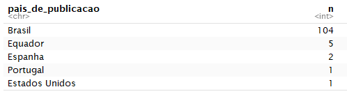

```{r setup, include=FALSE}
knitr::opts_chunk$set(echo = TRUE)
```

# 1. Introdução

Este relatório se propõe a explorar, interpretar e analisar cursos de Pós Graduação da Universidade de Brasília (UnB). Mais especificamente na área de conhecimento de Arquitetura e Urbanismo e Design. Como fonte de pesquisa será utilizada a plataforma e-Lattes UnB, que disponibiliza arquivos _json_ de todos os cursos da UnB. Nestes arquivos podemos explorar dados que contém informações sobre *publicações*, *perfil dos autores das publicações*, *período de atuação dos autores*, *categorias das publicações em cada ano*, dentre outros.

Além da análise dos dados, será apresentado um referencial teórico sobre as áreas de conhecimento presentes neste relatório, além da aplicação da metodologia *CRISP-DM* que é utilizada na Ciência de Dados.

### 1.1 Ciência de Dados

Data Science ou Ciência de Dados permite a extração de informações extremamente valiosas a partir de dados contidos em qualquer corporação ou empresa. Na era do Big Data, a ciência de dados está se tornando um campo promissor para processar grandes volumes gerados por diversas fontes e em diferentes velocidades. [5]

Em resumo é uma ciência que visa estudar as informações, seu processo de captura, transformação, geração e, posteriormente, análise de dados. [5]

A ciência de dados difere das análises estatísticas e da ciência da computação em seu método que é aplicado a dados coletados usando princípios científicos. A ciência de dados está procurando descobrir conhecimento a partir de uma quantidade grande e pesada de dados que podem ser usadas para tomar decisões e fazer previsões, e não simplesmente a interpretação de números. [5]

Para organizar, categorizar, estruturar e, depois, analisar essa quantidade exorbitante de dados, o data scientist é o profissional mais indicado. Este especialista também deve ser capaz de realizar tarefas, como extrair dados de bancos de dados MySQL e transformá-los em informações úteis e decifráveis por executivos de negócios por meio de gráficos e dashboards. [5]

No livro R for Data Science, os autores definem o fluxograma do processo de Data Science com seis etapas que englobam desde a coleta dos dados até a comunicação dos resultados com os públicos interessados, de maneira automatizada e rápida. As etapas são: importação, organização, transformação, visualização, modelagem e comunicação. Portanto, data science é a maneira de gerar conhecimento, de fazer ciência a partir dos dados. [5]


## 1.2 Cursos de Pós Graduação

Segundo a Capes, Programa de Pós-Graduação é o conjunto formado pelos cursos de mestrado e/ou doutorado acadêmicos ou de mestrado profissional de uma Instituição de Ensino Superior - IES atuante numa mesma área do conhecimento - sua área básica - que compartilha essencialmente o mesmo corpo docente e tem uma estrutura administrativa comum. Programas são divididos em acadêmicos ou profissionais, de acordo com a natureza do(s) curso(s).

A aplicação Coleta de Dados é um sistema informatizado da Capes, desenvolvido com o objetivo de coletar informações dos programas de pós-graduação stricto sensu do país. Com o lançamento da Plataforma Sucupira, o Coleta de Dados foi reformulado e passa a ser um dos módulos que a constituem.

A Plataforma Sucupira é uma importante ferramenta para coletar informações, realizar análises e avaliações e ser a base de referência do Sistema Nacional de Pós-Graduação - SNPG. A Plataforma deve disponibilizar em tempo real e com muito mais transparência as informações, processos e procedimentos que a Capes realiza no SNPG para toda a comunidade acadêmica. [3]

### 1.2.1 Arquitetura e Urbanismo

Simultaneamente à criação da Universidade de Brasília em 1962, o Curso de Mestrado em Arquitetura foi iniciado como o primeiro do país nesta área.  Em 1965 o curso foi sumariamente encerrado devido à crise política do período, retornando apenas em 1976 no  quadro do 2o Plano Nacional de Desenvolvimento com a criação do Mestrado em Planejamento Urbano.

O objetivo principal era atender as demandas por capacitação de recursos humanos no campo das políticas públicas e do desenvolvimento das cidades, contando com apoio do então Conselho Nacional de Política Urbana da Secretaria de Planejamento. [1]

Em 1986, foi criado o Mestrado em Desenho Urbano para o estudo da configuração físico-espacial das cidades. Este programa se consolidou como um dos principais centros de irradiação de conhecimentos nas áreas de Planejamento e Desenho Urbano.

Com mais de 40 anos de existência, O Programa de Pesquisa e Pós-Graduação da Faculdade de Arquitetura e Urbanismo da Universidade de Brasília (PPG-FAU/UnB) enfrentou desafios e transformações. Na última década o perfil do corpo de docentes e pesquisadores perceberam a necessidade de uma nova estrutura para abranger as mudanças no Curso de Mestrado e a criação do Curso de Doutorado em Arquitetura e Urbanismo. Em 2002 a proposta foi aprovada pela CAPES.

As áreas de concentração de pesquisa em que o Programa se fundamenta são: 

- *Teoria, história e crítica*

A área de concentração Teoria, História e Crítica realiza pesquisas em torno dos processos históricos de concepção, transformação e reflexão sobre arte, arquitetura e cidade. A formação nessa área transita desde os fundamentos epistemológicos e sociais da cultura material até a articulação crítica do pensamento sobre o patrimônio cultural, passando pelo estudo empírico e documental, com metodologias diversas e enfoque interdisciplinar. Acolhe recortes espaço-temporais diversos, com ênfase na região de Brasília em perspectiva diacrônica. [2]

- *Tecnologia, ambiente e sustentabilidade*

A área de Tecnologia, Ambiente e Sustentabilidade compreende estudos relativos a técnicas e processos ligados à produção da Arquitetura e do ambiente construído, com especial atenção à questão da sustentabilidade. Os sistemas estruturais são estudados no âmbito específico da Arquitetura e etapas da construção, desde os projetos e técnicas de produção até seu desempenho são objeto de pesquisas. O contexto urbano comparece com pesquisas relativas a qualidade do espaço e sua gestão, reabilitação em seus aspectos físicos e socioambientais. [2]

- *Projeto e Planejamento*

A área de Projeto e Planejamento abarca estudos sobre políticas, planos e gestão em escalas diversas, do edifício ao território. As pesquisas voltadas para o âmbito edilício envolvem estratégias projetuais, configuração, representação e acessibilidade. Entre os temas diversos dos estudos relacionados ao urbano, podem-se citar análises e proposições sobre planejamento urbano e territorial, legislação, reabilitação, regularização fundiária urbana e mobilidade. [2]

### 1.2.2 Design

No segundo semestre de 2013 foi criado o curso de mestrado acadêmico em Design. O Programa de Pós Graduação em Design da Universidade de Brasília - PPG Design UnB - faz parte do Instituto de Artes e do Departamento de Design da UnB.

Os objetivos do Programa são:

- Possibilitar a formação de docentes na área de design com vistas a ampliação e melhor qualificação dos docentes na região Centro-Oeste e Norte do país.
- Desenvolver pesquisadores em design, possibilitando o desenvolvimento tecnológico, cultural e econômico do país.
- Aproximar o design da sociedade por meio de pesquisas relacionadas aos processos de produção e inovação com base tecnológica.

O grupo do PPG Design UnB busca construir um programa de qualidade, integrado com as necessidades da pesquisa em design, ao mesmo tempo, ativo na produção do conhecimento e na busca por projetos cooperativos. Através de suas ações, contribui para ampliar as pesquisas em Design desenvolvidas na região, aumentando a produção bibliográfica e a geração de conhecimento e inovação. A diversidade da temática das pesquisas pode ser observada também no projetos de pesquisas dos discentes, sendo que muitos são oriundos de outros estados. Isto demonstra a vocação do PPG Design UnB em agregar pluralidade cultural e interdisciplinar que pode ser vista nos projetos de pesquisas desenvolvidos no programa. [4]

As áreas de concentração de pesquisa em que o Programa se fundamenta são _Design, Tecnologia e Sociedade_.

# 2. CRISP-DM

O desenvolvimento e apresentação de resultados, como sugerido no plano de ensino, deve seguir a metodologia CRISP-DM (__Cross Industry Standard Process for Data Mining__), que é um dos melhores e mais conhecidos modelos de análise e exploração de dados. Proposto em 1996, o modelo trata-se de um processo de data mining ou mineração de dados desvendo fases e o correto caminho a ser seguido quando estamos lidando com análise de dados e seus problemas relacionados. [6]

O processo é composto por 6 (seis) grandes etapas principais: Business Understanding; Data Understanding; Data Preparation; Modeling; Evaluation; Deployment. É importante destacar que o processo e ela é interativa e incremental e não necessariamente linear de uma fase para a outra, o que pode ser visto na figura a seguir. [6]

No relatório, o CRISP-DM será utilizado como metodologia de exploração de dados, a fim de obter uma


## 2.1 Compreensão de Negócios

A primeira e uma das etapas mais importantes do processo consiste em realizar e extrair informações relevantes sobre qual o contexto a ser trabalhado, qual a área de conhecimento, quais os objetivos e requisitos do projeto para poder, assim, traçar um plano claro sobre as ações que devem ser tomadas. [6]

No contexto da disciplina de Data Science 4 All (DS4A) & Ciência de Dados Aplicada, nos cursos de Arquitetura e Urbanismo e Design, o objetivo traçado foi extrair informações relevantes referentes as publicações e os autores destes cursos, tais como publicações por ano, publicações por país, palavras relevantes nas publicações, autores com mais publicações, dentre outros.

## 2.2 Compreensão dos dados

Com a primeira fase já previamente estabelecida, uma outra etapa tão importante quanto, é a fase de onde somos capaz de inspecionar, organizar e descrever os dados disponíveis para a resolução do problema. É uma etapa importante também para a familiarização com os dados de insumo para a realização das análises, possibilitando também que alguns _insights_ sejam previamente levados em consideração para etapas futuras. [6]

O estudo de todas as tabelas disponíveis e realizar a medição da possibilidade de criação de uma visão única para a análise também é parte dessa fase. [6]

Visto isso, foram realizados os passos abaixo para realizar análises relevantes dos datasets disponíveis.

### 2.2.1 Importando as bibliotecas

Primeiramente foi importado as bibliotecas para possibilitar a leitura e manipulação dos dados.

```{r eval=FALSE} 
library(jsonlite)
library(plyr)
library(dplyr)
library(RColorBrewer)
library(stringr)
library(ggplot2)
library(tidyr)
library(scales)
```

## 2.2.2 Importando arquivos de publicações no formato JSON

O arquivos importados abaixos representam os dados sobre publicações disponibilizados pela plataforma e-Lattes da UnB dos cursos citados acima.

```{r eval=FALSE} 
publicacoes_arquitetura <- fromJSON("ArquiteturaPos/235.publication.json")
publicacoes_design <- fromJSON("DesignPos/267.publication.json")
```

## 2.2.3 Descrição dos Dados

Foi utilizado a função `head()` para ter uma prévia das colunas e alguns registros presentes nos arquivos _json_ importados.

```{r eval=FALSE}
head(publicacoes_arquitetura)
head(publicacoes_design)
```

Com isso, foi possível observar a presença das seguintes colunas no _json_ de publicações:

- *natureza*: Status atual da publicação;
- *titulo*: Título da publicação;
- *nome_do_evento*: Evento no qual foi plubicado;
- *ano_do_trabalho*: Ano que a publicação foi feita;
- *pais_do_evento*: País sede do evento da publicação;
- *cidade_do_evento*: Cidade do evento da publicação;
- *doi*: Código universal da publicação (DOI);
- *classificação*: Internacionalização da publicação;
- *paginas*: Páginas onde se encontra a publicação;
- *autores*: Lista dos criadores da publicação;
- *autores-endogeno*: Autores endógenos da publicação.

## 2.3 Preparação dos Dados

Abrange todas as atividades para construir o conjunto final de dados, realizando o tratamento, seleção, limpeza e estruturação dos dados disponíveis. O output desta preparação de dados são os dados finais que serão utilizados para o desenvolvimento do modelo. [6]

## 2.3.1 Transformando em _Dataframes_

Descrever...

```{r eval=FALSE} 
# Arquitetura
df_pub_arquitetura <- sapply(publicacoes_arquitetura, ldply, data.frame) %>% bind_rows() %>% as_tibble()

# Design
df_pub_design <- sapply(publicacoes_design, ldply, data.frame) %>% bind_rows() %>% as_tibble()
```

## 2.3.2 Descrição dos _Dataframes_

Descrever...

```{r eval=FALSE} 
# Arquitetura
head(df_pub_arquitetura)

# Design
head(df_pub_design)
```

### 2.3.3 Separação de Publicações por autor

Descrever...

```{r eval=FALSE} 
# Arquitetura
pub_arquitetura_autores.endo <- df_pub_arquitetura %>% unnest(autores.endogeno) %>% distinct()

# Design
pub_design_autores.endo <- df_pub_design %>% unnest(autores.endogeno) %>% distinct()
```

### 2.3.4 Separação de Periódicos por Autor

Descrever...

```{r eval=FALSE}
# Arquitetura
pub_arquitetura_periodicos <- pub_arquitetura_autores.endo %>% filter(is.element(pub_arquitetura_autores.endo$periodico, pub_arquitetura_autores.endo$ano))

# Design
pub_design_periodicos <- pub_design_autores.endo %>% filter(is.element(pub_design_autores.endo$periodico, pub_design_autores.endo$ano))
```

## 2.4 Modelagem

Essa fase é uma etapa mais voltada para Pesquisa e Desenvolvimento, onde são selecionadas diferentes técnicas de modelagem, para realizar diferentes parâmetros, calibragens e etc. Em um problema de mineração de dados, muitas vezes é possível realizar a análise dos dados utilizando diferentes abordagens, considerando também o tipo e estrutura de dado que essa etapa recebe de input da fase de preparação de dados. [6]

A comunicação com a fase de preparação de dados nessa fase é muito importante, para a experimentação e modelagem utilizando diferentes técnicas e abordagens. [6]

*Fazer...*

## 2.5 Avaliação do Modelo

Com o modelo em mãos é possível realizar a avaliação dos seus resultados de maneira detalhada e revisar as etapas executadas para que os mesmo estejam dentro dos previstos e cumpram os requisitos identificados na fase de entendimento do negócio. [6]

*Fazer...*

## 2.6 Desenvolvimento

Com todas as etapas tendo sido percorridas, mesmo não sendo o fim do processo - como citado inicialmente, o processo é iterativo e incremental -, é preciso demonstrar os resultados e para que o modelo preparado seja utilizado. No caso da disciplina, a parte de implantação consiste basicamente em elaborar um relatório final para demonstrar os dados e as mais diversas informações que eles fornecem sobre os projetos de Pós-Graduação de Arquitetura e Urbanismo. Em diferentes contextos, poderia ser utilizado o modelo para entregar informações em tempo real para o usuário final, por exemplo. [6]

### 2.6.1 Publicações por Ano

Descrever...

```{r eval=FALSE}
# Arquitetura
ggplot(pub_arquitetura_periodicos, aes(x = .id )) +
ggtitle("Qtde de Publicações por Ano - Pós Graduação Arquitetura") +
labs(y = "Total de Publicações", x = "Ano") +
geom_histogram(stat ="count" ,fill = "#1123A4")
```


```{r eval=FALSE}
# Design
ggplot(pub_design_periodicos, aes(x = .id )) +
ggtitle("Qtde de Publicações por Ano - Pós Graduação Design") +
labs(y = "Total de Publicações", x = "Ano") +
geom_histogram(stat ="count" ,fill = "#11BAA4")
```


Explicar...

### 2.6.2 Publicações por País

Descrever...

```{r eval=FALSE}
# Arquitetura
pub_arquitetura_group <- select(pub_arquitetura_periodicos, c("periodico", "pais_de_publicacao"))
arquitetura_qtde_pub_pais <- pub_arquitetura_group %>% add_count(pais_de_publicacao)
arquitetura_qtde_pub_pais_distinct <- arquitetura_qtde_pub_pais %>% distinct(pais_de_publicacao, n)
```

Explicar...

```{r eval=FALSE}
cols <- colorRampPalette(brewer.pal(12, "Set2"))
myPal <- cols(length(unique(arquitetura_qtde_pub_pais_distinct$pais_de_publicacao)))

ggplot(arquitetura_qtde_pub_pais_distinct, aes(x= "", y= n, fill = arquitetura_qtde_pub_pais_distinct$pais_de_publicacao)) +
ggtitle("Qtde de Publicações por País - Pós Graduação Arquitetura") +
geom_bar(width = 1, stat ="identity") +
coord_polar("y") +
labs(fill='Paises') +
theme (
  axis.title.x = element_blank(),
  axis.title.y = element_blank(),
  panel.border = element_blank(),
  panel.grid=element_blank(),
  axis.ticks = element_blank()
) +
# geom_text(aes(y = n/2 + c(0, cumsum(n)[-length(n)]), label = percent(n/100)), data = arquitetura_qtde_pub_pais_distinct, size=2) +
scale_fill_manual(values = myPal, na.value = "#FF8D59")

head(arquitetura_qtde_pub_pais_distinct, n = 14L)

```


Interpretar Gráfico...

```{r eval=FALSE}
# Arquitetura
pub_design_group <- select(pub_design_periodicos, c("periodico", "pais_de_publicacao"))
design_qtde_pub_pais <- pub_design_group %>% add_count(pais_de_publicacao)
design_qtde_pub_pais_distinct <- design_qtde_pub_pais %>% distinct(pais_de_publicacao, n)
```

Explicar...

```{r eval=FALSE}
ggplot(design_qtde_pub_pais_distinct, aes(x= "", y= n, fill = design_qtde_pub_pais_distinct$pais_de_publicacao)) +
ggtitle("Qtde de Publicações por País - Pós Graduação Design") +
geom_bar(width = 1, stat ="identity") +
coord_polar("y") +
labs(fill='Paises') +
theme (
  axis.title.x = element_blank(),
  axis.title.y = element_blank(),
  panel.border = element_blank(),
  panel.grid=element_blank(),
  axis.ticks = element_blank()
) +
scale_fill_manual(values = myPal, na.value = "#FFa1e2")

head(design_qtde_pub_pais_distinct, n = 6L)

```




Interpretar Gráfico...

# Referências

1. [Histórico da PGG - FAU](http://www.ppgfau.unb.br/institucional/historico-da-ppg-fau).
2. [Áreas de Concentração - FAU](http://www.ppgfau.unb.br/institucional/historico-da-ppg-fau).
3. [COLETA DE DADOS Conceitos e orientações - Manual de preenchimento da Plataforma Sucupira](https://www.capes.gov.br/images/stories/download/avaliacao/avaliacao-n/ColetaDados-PlataformaSucupira-Manual-Abr14.pdf).
4. [PGG - Departamento de Design](http://design.unb.br/index.php?option=com_content&view=article&id=56&Itemid=167&lang=pt-br).
5. [Introdução à Ciência de Dados 2.0 - Data Science Academy](https://www.datascienceacademy.com.br/course?courseid=introduo--cincia-de-dados).
6. [Afinal, o que é Data Science? - ABG Consultoria Estatística](http://www.abgconsultoria.com.br/blog/afinal-o-que-e-data-science/).